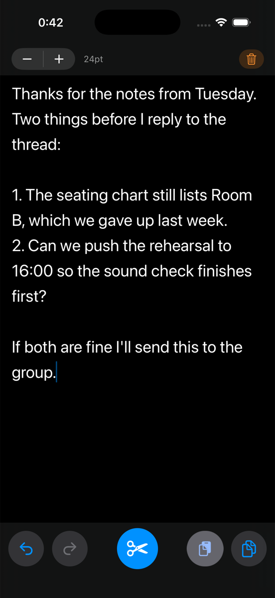
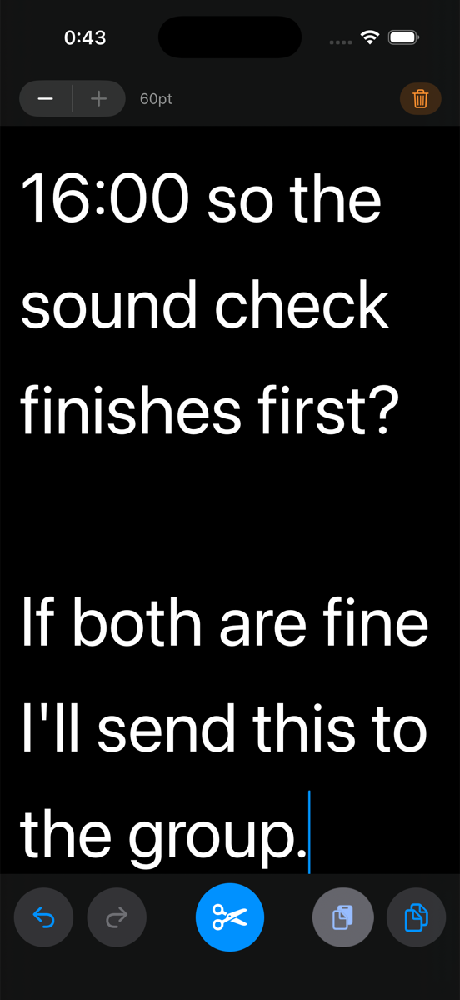
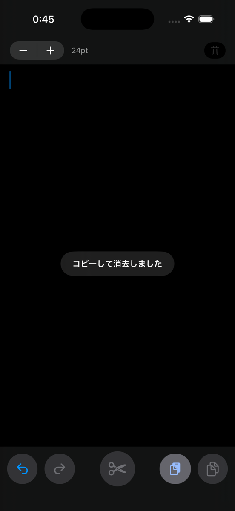

# EathWrit — 書いて、コピーして、捨てるための iPhone 用スクラッチパッド


**English documentation is available in [README.md](README.md).**

---

EathWrit は、他のアプリに貼り付けるための文章を書くための、1画面だけの iPhone 用テキストエディタです。チャットの返信、検索窓に入れる文言、LLM へのプロンプト、フォームの入力欄——そういう「どこか別の場所に持っていく文章」を、画面いっぱいの広い入力面で書くためのアプリです。バッファは1つだけで、ファイルもタイトルもノート一覧もありません。書いたら **Copy & Clear** を1回押すだけで、全文がクリップボードに入り、画面は空になります。Drafts や Bear、iA Writer のような「書いたものを残す」ことを前提にしたアプリとは逆に、EathWrit は「残さない」ことを前提に作られているので、あとから名前を付けたり整理したり削除したりする対象が一切生まれません。

> **iPhone 専用・縦画面のみ・iOS 17.0 以降が必要です。** App Store では配布しておらず、Xcode プロジェクトとして配布しています。自分の署名でビルドしてインストールしてください。iPad レイアウト・横画面・Mac 版はありません。

アプリ名は古英語に由来します。*ēaþe*（＝easy、たやすい）＋ *writ*（＝書かれたもの）で「easy write」という意味です。

| 24pt で編集中 | 同じ本文を 60pt で | 1タップでコピー＆消去 |
|---|---|---|
|  |  |  |

## EathWrit が解決するペイン

他のアプリの中にある iOS のテキストフィールドは、短い返信を書くために作られていて、その用途ではよくできています。ただ、そこで想定されていないのが「編集」です。そして2〜3文を超える長さの文章では、やることのほとんどが編集になります。

具体的には、次の3つが繰り返し起こります。

- **カーソルを狙った位置に置くのが難しい。** 2行しかないフィールドに標準サイズの文字が並んでいると、文字と文字の間はとても小さなターゲットです。段落の途中の1語を直したいだけなのに、拡大鏡を出して、少しずらして、もう一度タップして……という往復が発生します。
- **範囲選択して切り取るのが億劫。** 狭いフィールドでは選択ハンドルの操作がシビアで、表示範囲の端まで来ると選択がスクロールして逃げていきます。文末の1文を文頭に移動するといった操作は、スマートフォンではかなり面倒な部類に入ります。
- **アプリごとに挙動が違う。** LINE をはじめ、多くのメッセージアプリはシステム標準ではなく独自の入力ビューを実装しています。そのため選択ハンドル・編集メニュー・Undo・キーボードの閉じ方が少しずつ違い、あるアプリで身につけた操作感が別のアプリでは通用しません。

EathWrit の答えは、「書く場所そのものをそのフィールドの外に出す」ことです。画面いっぱいの `UITextView` が1つあり、iOS 標準の編集挙動がそのまま使えます。文字は最大 60pt まで大きくできるのでカーソルは狙ったところに落ち、Undo も確実に効きます（全消去すら取り消せます）。書き終わったら1タップでコピーと画面クリアが同時に終わり、貼り付け先のアプリには「完成した文章」を貼るだけになります。

引き換えに増えるのはペースト1回分の手間です。得られるのは、どのアプリ宛ての文章でも同じように振る舞う、予測可能な編集環境です。

## クイックスタート

```bash
git clone <your-fork-url> EathWrit
open EathWrit/EathWrit.xcodeproj
```

Xcode を開いたら、**Signing & Capabilities** で自分の開発チームを選び、実行先に自分の iPhone を指定して ⌘R を押してください。アプリはキーボードが上がった状態のエディタに直接起動します。起動画面もオンボーディングもアカウント登録もありません。

## なぜ「捨てる前提」のエディタなのか

下書きをする場所として真っ先に思いつくのはメモアプリですが、それだとメッセージを送るたびにメモが1つ残り、いつか時間を取って消す作業が発生します。スマートフォンで打つ文章のほとんどは、実はメモではありません。これから送るメッセージだったり、推敲中のプロンプトだったり、フォームに入れる文章だったりします。行き先があり、そこに届いた時点で下書きの役目は終わります。

そこで EathWrit は、バッファを1つだけ持ち、「捨てる」ことをおまけではなく主操作にしています。

```
1. アプリを開く            → キーボードは上がっていて、カーソルは入力欄の中
2. 24pt で書く             → 14pt〜60pt はステッパーで変更できます
3. ✂（Copy & Clear）を押す → 全文がクリップボードに入り、画面が空になります
4. 貼り付け先のアプリでペースト
```

3 の操作は取り消せます。うっかり消してしまっても **Undo** で全文が戻ります。クリア処理は通常の入力と同じ Undo スタックに積まれているためです。

## テキスト編集機能

- **iOS 標準の編集操作を、大きな画面で** — 本文はただの `UITextView` なので、カーソル移動・選択ハンドル・編集メニュー・カット／コピー／ペーストはすべてシステム標準の実装がそのまま動きます。24〜60pt の文字が画面いっぱいに広がっているぶん、それぞれの操作が正確に決まります。
- **1つだけの永続バッファ** — アプリを終了しても再起動しても本文は残ります。変更のたびに `UserDefaults` の `draft` キーへ保存しているので、次に開いたときは中断したところから続けられます。
- **1タップの Copy & Clear** — 中央のボタンは、全文をクリップボードにコピーしてからバッファを空にする操作を1アクションで行います。これがこのアプリの主操作です。
- **クリアを取り消せます** — Clear と Copy & Clear はどちらも、直接代入ではなく `UITextInput` 経由のテキスト置換として実行しています。そのため標準の Undo スタックに積まれ、Undo ボタンで元に戻せます。
- **Undo / Redo に対応** — SwiftUI の `TextEditor` は `UndoManager` を外部に公開しないため、EathWrit は `UITextView` を自前で包んでいます。Undo / Redo ボタンは `NSUndoManager` の通知を監視して自動で有効・無効が切り替わります。
- **文字サイズは 14pt〜60pt** — 上部バーのステッパーで 4pt 刻みに変更できます。初期値は 24pt で、現在のサイズは隣にポイント数で表示されます。
- **文字サイズに連動する行間** — 行間はフォントサイズの 35% に設定しているので、60pt にしても 14pt と同じように読みやすさが保たれます。
- **親指の届く位置にボタンを配置** — よく使う操作（Undo / Redo / Copy & Clear / Paste / Copy）は下部バーに、誤って押したくない Clear は届きにくい上部バーに置いています。
- **システム標準のペーストボタン** — Paste には OS 提供の `UIPasteControl` を使い、他のボタンと揃うよう円形にスタイルしています。
- **キーボードを指で下げられます** — 本文を下にドラッグすると、キーボードが指に追従して下がります。
- **スマート引用符・スマートダッシュは無効** — 打った引用符やハイフンがそのまま残ります。コードや URL、プロンプトに貼り付けるときに効いてきます。
- **触覚フィードバック** — サイズ変更と Undo / Redo では軽いタップ、コピーとクリアでは成功の通知フィードバックが返ります。

## EathWrit と Drafts / Bear / iA Writer / 標準の入力欄の比較

| | EathWrit | Drafts | Bear | iA Writer | アプリ標準の入力欄 |
|---|---|---|---|---|---|
| 価格 | 無料（自分でビルド） | 無料枠＋サブスク | 無料枠＋サブスク | 有料 | 無料 |
| 基本モデル | 使い捨てバッファ1つ | 受信箱に貯めてアクション | タグ付きノート library | ドキュメント library | ホストアプリ依存 |
| 書いたものの後始末 | 何も残らない | 受信箱に溜まる | ノートが溜まる | ファイルが溜まる | 何も残らない |
| 入力面 | 全画面・14〜60pt | 全画面 | 全画面 | 全画面 | 1〜3行のことが多い |
| 全文コピー＋クリア | ボタン1つ | 複数ステップ | 手動 | 手動 | 手動 |
| クリア後の Undo | できます | 該当なし | 該当なし | 該当なし | たいてい不可 |
| 同期 | なし（端末内のみ） | iCloud | iCloud / Bear sync | iCloud | 該当なし |
| Markdown・書式 | なし | あり | あり | あり | なし |
| ソースコード | 公開・Swift 4ファイル | 非公開 | 非公開 | 非公開 | 該当なし |

**EathWrit を選ぶとき** — 書いている文章の行き先が、いま打っているアプリとは別の場所にあり、その文章をどこにも残したくない場合です。

**Drafts を選ぶとき** — 同じように素早く書き始めたいけれど、書いたテキストをアクションで複数の送り先に振り分けたい場合です。受信箱に下書きが溜まっていくことを許容できるなら Drafts が向いています。

**Bear を選ぶとき** — 書いたものを実際に残す場合です。タグやリンク、検索のほうが「捨てやすさ」より重要なときに向いています。

**iA Writer を選ぶとき** — 最終的にドキュメントになる長文を Markdown で書く場合です。フォーカスモードや組版の質を重視するときに向いています。

**アプリ標準の入力欄を使うとき** — 1行の短い文章で、狭さが問題になっていない場合です。

## こんな人に向いています

- **メッセージやプロンプトを送る前に下書きしたい iPhone ユーザー** — 全画面の広いバッファで書いてから、チャットアプリや LLM のプロンプト欄、Web フォームに貼り付けられます。
- **スマートフォンで大きい文字が必要な人** — 60pt の文字と比例した行間により、標準のエディタの文字が小さすぎて推敲しづらい場面でも読み書きできます。
- **SwiftUI と UIKit の連携例を探している Swift 開発者** — 4ファイル・合計 447 行で、`UIViewRepresentable` による `UITextView` のラップ、Undo スタックの扱い、`UIPasteControl` の組み込みが一通り読めます。
- **独自の入力欄を持つアプリで長文を書く人** — LINE のように入力ビューを自前で実装しているメッセージアプリは、それぞれ操作感が少しずつ違います。EathWrit で下書きすれば、送り先がどこであっても編集環境は1つに揃います。
- **使い捨てメモの後片付けが煩わしい人** — あとから削除しなければならないものが原理的に生まれない設計になっています。

## ボタン一覧

| 位置 | ボタン | 役割 | 補足 |
|---|---|---|---|
| 上部バー | ステッパー `−` / `+` | 文字サイズ変更 | 14〜60pt、4pt 刻み、初期値 24pt |
| 上部バー | 🗑 Clear | コピーせずに本文を消す | 空のときは無効。Undo で戻せます |
| 下部バー | ↺ Undo | 直前の編集やクリアを取り消す | Undo スタックが空のときは無効 |
| 下部バー | ↻ Redo | 取り消した編集をやり直す | Redo スタックが空のときは無効 |
| 下部バー | ✂ **Copy & Clear** | 全文をコピーしてから消す | 主操作。1つだけ大きく塗りが反転しています |
| 下部バー | Paste | クリップボードをカーソル位置に挿入 | システムの `UIPasteControl`。タップごとに許可を確認します |
| 下部バー | ⧉ Copy | 全文をコピーする（消さない） | 空のときは無効 |

## 動作要件

- **iOS 17.0 以降** — 引数2つの `onChange(of:)` と `Task.sleep(for:)` を使っています。
- **iPhone** — `TARGETED_DEVICE_FAMILY` は iPhone のみに設定され、画面は縦向きに固定されています。
- **署名可能な Xcode 環境** — プロジェクトには開発チームとバンドル ID `com.masatora.eathwrit` が設定されています。ビルド前にどちらも自分のものに変更してください。
- **サードパーティ依存なし** — import しているのは SwiftUI・UIKit・Foundation だけです。パッケージマニフェストも CocoaPods も Carthage もありません。

## インストール

1. リポジトリを clone して `EathWrit.xcodeproj` を Xcode で開きます。
2. **EathWrit** ターゲット → **Signing & Capabilities** を開きます。
3. `PRODUCT_BUNDLE_IDENTIFIER`（`com.masatora.eathwrit`）を自分が所有する識別子に変更し、**Team** を自分の Apple ID または開発チームに設定します。
4. 実行先に自分の iPhone を選んで ⌘R を押します。

無料の Apple ID でビルドした場合、インストールしたアプリは7日で期限切れになるため、そのつど再ビルドが必要です。有料の Apple Developer Program に加入していれば1年に延びます。

## 使い方

**入力する。** エディタは上下のバーに挟まれた画面全体です。起動時に自動でキーボードが上がるので、最初の1文字を打つのにタップは要りません。

**文字サイズを変える。** 左上のステッパーを使います。現在のサイズは `24pt` のように表示され、`UserDefaults` の `fontSize` キーに保存されるので次回起動時も維持されます。長押しするとリピートします。

**コピーする。** ⧉ Copy は全文をクリップボードに入れ、本文はそのまま残します。✂ Copy & Clear は同じことをしてから本文を消します。どちらも 1.5 秒だけトーストが表示されます。

**消す。** 上部バーの 🗑 Clear はコピーせずに本文を消します。トーストで「Undo で戻せる」ことを知らせます。

**貼り付ける。** Paste ボタンはシステムのペーストコントロールです。responder chain に頼らずペースト先を明示的に指定している都合上、タップのたびに iOS が許可を確認します。貼り付けたテキストはカーソル位置に挿入され、Undo で取り消せます。

## よくある質問

### EathWrit は無料ですか？

無料です。EathWrit は MIT ライセンスのオープンソースで、有料プランもサブスクリプションもアプリ内課金もありません。ソースコードとして配布しているので、コストは自分でビルドする手間だけです。個人の Apple ID なら費用はかからず、7日で期限切れにならないビルドが欲しい場合のみ Apple Developer Program の費用がかかります。

### 送り先のアプリで直接書けばよいのでは？

短い返信ならそのほうが早いです。EathWrit が効くのは、文章が長くなって「編集」が必要になったときです。1文を移動する、途中の1語を直す、1段落を切り取って考え直す——こうした操作は、2〜3行の入力欄ではカーソル位置の指定も選択ハンドルの操作も精度が出ません。さらに、システム標準ではなく独自の入力ビューを使っているアプリ（LINE などが代表例です）では、これらの挙動がアプリごとに違います。EathWrit で下書きすれば、iOS 標準の編集挙動を最大 60pt の文字で使えて、送り先には完成した文章をクリップボード経由で渡すだけになります。

### EathWrit は Drafts の無料代替になりますか？

一部は代替になります。「アプリを開けばキーボードが上がっていて、すぐ書き始められる」という素早い入力の部分は Drafts と同じです。ただし Drafts のアクション機能・ワークスペース・同期に相当するものはありません。Drafts を「コピーしたら消すスクラッチ用バッファ」として使っているなら EathWrit で置き換えられます。リマインダーやメール、スクリプトへテキストを振り分ける用途で使っているなら代替にはなりません。

### メモアプリとは何が違うのですか？

メモアプリは書いたものを残しますが、EathWrit は捨てることを前提にしています。バッファは1つだけで、ノート一覧もタイトルもファイル管理もありません。主操作のボタンは、コピーと画面クリアを同じタップで行うので、あとから削除すべきものが残りません。

### iCloud や Mac と同期しますか？

同期しません。本文は端末内の `UserDefaults` にだけ保存され、外に出ることはありません。iCloud コンテナもアカウントもなく、アプリにはネットワーク通信のコードが一切含まれていません。

### Copy & Clear を押したあとで本文を復元できますか？

2通りの方法で復元できます。まず全文がクリップボードに入っているので貼り戻せます。さらに Undo スタックにも残っているので、Undo ボタンを押せば消した本文が戻ります。クリアを直接代入ではなくテキスト置換として実装しているためです。

### Markdown やリッチテキストに対応していますか？

対応していません。本文はプレーンテキストで、フォントサイズも全体で一律です。太字も見出しもリストも Markdown プレビューもありません。これは意図的な設計で、書式を付けても貼り付け先のアプリでは失われるためです。

### iPad や Mac でも動きますか？

動きません。Xcode のターゲットは iPhone のみに設定され、縦画面に固定されています。iPad・Mac Catalyst・visionOS 向けのビルドとテストは行っていません。

### 文字はどこまで大きくできますか？

ステッパーの範囲は 14pt〜60pt で、4pt 刻み、初期値は 24pt です。行間はフォントサイズの 35% として計算されるので、60pt にしても文字が詰まって読みにくくなることはありません。

### なぜ Paste ボタンは毎回許可を求めるのですか？

ペースト先を明示的に指定しているためです。`UITextView` は SwiftUI の別サブツリーにあり responder chain を辿れないので、`UIPasteControl` に直接ターゲットを渡しています。その結果、iOS はタップのたびに新しいペースト要求として扱います。これは、ペーストボタンを他の円形ボタンと同じ見た目に揃えるための既知のトレードオフです。SwiftUI の `PasteButton` はサイズも色も指定できません。

### 本文は暗号化・保護されますか？

iOS の標準的な保護以上のことはしていません。本文は `UserDefaults` に保存され、端末標準のファイル保護は受けますが、個別の暗号化はされておらず Face ID による保護もかかりません。パスワードや機密情報の置き場所としては使わないでください。

### インターフェースの言語は何ですか？

ボタンはアイコンのみで、アクセシビリティラベルは英語（Undo / Redo / Copy & Clear / Paste / Copy / Clear）です。文字として表示されるのは3つのトーストだけで、こちらは日本語です（「コピーしました」「コピーして消去しました」「消去しました（Undoで戻せます）」）。いずれも `EditorView.swift` の文字列リテラルなので、変更は1分で終わります。

### ボタン配置を変えたり機能を追加したりできますか？

できます。むしろそれがこのリポジトリの想定された使い方です。アプリ全体で 4ファイル・447 行です。[`EathWritApp.swift`](EathWrit/EathWritApp.swift)（エントリポイント）、[`EditorView.swift`](EathWrit/EditorView.swift)（レイアウト・上下バー・トースト）、[`EditorTextView.swift`](EathWrit/EditorTextView.swift)（`UITextView` のラップと Undo 処理）、[`Clipboard.swift`](EathWrit/Clipboard.swift)（クリップボードと触覚フィードバック）という構成です。ボタンの径・フォントサイズの範囲・刻み幅は `EditorView` の先頭に定数としてまとまっています。

## 制限事項

- **同期もバックアップもありません** — 本文は端末内にのみ存在します。アプリを削除すると失われます。
- **バッファは1つだけです** — 2つの文章を同時に保持することはできません。
- **検索・タグ・履歴はありません** — 消した本文は Undo スタックから外れた時点で復元できません。
- **iPad・Mac・横画面には対応していません** — iPhone の縦画面専用です。
- **App Store では配布していません** — Xcode で自分でビルドして署名する必要があります。
- **テキストの書き出し機能はありません** — 本文はクリップボード経由でのみ持ち出せます。共有シートやファイル出力はありません。
- **自動テストはありません** — テストターゲットは含まれていません。
- **Undo 履歴は保存されません** — 本文は再起動後も残りますが、Undo スタックは残りません。

## フォークして自分のツールにしてください

EathWrit はコントリビューションを募集していません。4ファイル・447 行——コーディングエージェントが一度に全部読み切れる分量です。だからこそ、プルリクエストを送るよりも、フォークまたは clone して「自分が欲しい道具」に作り変えてしまうほうが早いはずです。

1ファイルの修正で収まる、現実的な改造の例です。

- **ボタンを差し替える** — Copy & Clear を「コピーして貼り付け先アプリを開く」に変える、定型文で囲むボタンを足す、など。ボタンの定義は `EditorView.swift` の上下バーにまとまっています。
- **フォントを変える** — `EditorTextView.swift` の `UIFont.systemFont(ofSize:)` を等幅や明朝に置き換えるだけです。
- **トーストの文言を変える** — `EditorView.swift` の文字列リテラル3つです。
- **バッファを複数にする** — `EditorController` は `UserDefaults` の `draft` キー1つに保存しています。キーを複数にしてタブを付けるのは小さな変更です。
- **クリップボードではなく共有シートに出す** — テキストの出口は `Clipboard.copy` の1箇所だけです。

コーディングエージェントにこのリポジトリを読ませて、欲しい道具を説明して、合わない部分を書き換えさせてください。MIT ライセンスはそのためにあります。

## ライセンス

MIT — [LICENSE](LICENSE) を参照してください。
